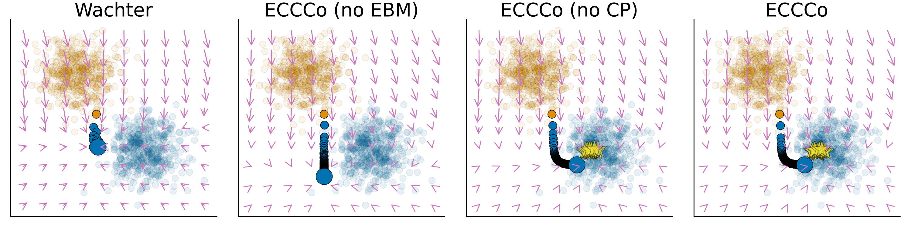

# ECCCo



This is the code base used for our [AAAI 2024](https://aaai.org/aaai-conference/2024) paper *Faithful Model Explanations through Energy-Constrained Counterfactual Explanations*. The pre-print version of the paper is available on [arXiv](https://arxiv.org/abs/2312.10648).

## Inspecting the Package Code

This code base is structured as a Julia package. The package code is located in the `src/` folder.

## Inspecting the Results

All results have been carefully reported either in the paper itself or in the supplementary material. In addition, we have released our results as binary files. These will be made publicly available after the review process. 

## Reproducing the Results

This repo contains a small Julia package that will eventually be merged into [CounterfactualExplanations.jl](https://github.com/JuliaTrustworthyAI/CounterfactualExplanations.jl) and is therefore not registered on the general registry. You can install the package directly from here as follows:

```julia
using Pkg
Pkg.add(url="https://github.com/pat-alt/ECCCo.jl")
```

This will automatically set up the environment and install all the necessary dependencies.

### Sequential

The `experiments/` folder contains separate Julia scripts for each dataset and a [run_experiments.jl](experiments/run_experiments.jl) that calls the individual scripts. You can either run these scripts inside a Julia session or just use the command line to execute them as described in the following.

To run the experiment for a single dataset, (e.g. `linearly_separable`) simply run the following command:

```shell
julia --project=experiments/ experiments/run_experiments.jl -- data=linearly_separable
```

We use the following identifiers:

- `linearly_separable` (*Linearly Separable* data)
- `moons` (*Moons* data)
- `circles` (*Circles* data)
- `california_housing` (*California Housing* data)
- `gmsc` (*GMSC* data)
- `german_credit` (*German Credit* data)
- `mnist` (*MNIST* data)
- `fmnist` (*Fashion MNIST* data)

To run experiments for multiple datasets at once simply separate them with a comma `,`

```shell
julia --project=experiments/ experiments/run_experiments.jl -- data=linearly_separable,moons,circles
```

To run all experiments at once you can instead run

```shell
julia --project=experiments/ experiments/run_experiments.jl -- run-all
```

Pre-trained versions of all of our black-box models have been archived as `Pkg` [artifacts](https://pkgdocs.julialang.org/v1/artifacts/) and are used by default. Should you wish to retrain the models as well, simply use the `retrain` flag as follows:

```shell
julia --project=experiments experiments/run_experiments.jl -- retrain data=linearly_separable
```

### Multi-threading

To use multi-threading, proceed as follows:

```shell
julia --threads 16 --project=experiments experiments/run_experiments.jl -- data=linearly_separable threaded
```

### Multi-Processing

To use multi-processing, proceed as follows:

```shell
mpiexecjl --project=experiments -n 4 julia experiments/run_experiments.jl -- data=linearly_separable mpi
```

Multi-processing and multi-threading can be combined:

```shell
mpiexecjl --project=experiments -n 4 julia experiments/run_experiments.jl -- data=linearly_separable threaded mpi
```

## Reproducing Figures

To recreate the exact figures shown in the main paper you can use two notebooks:

- `experiments/notebooks/figure2.qmd`: Figure 2 (gradient fields)
- `experiments/notebooks/figure1and3.qmd`: Figures 1 and 3 (MNIST examples)