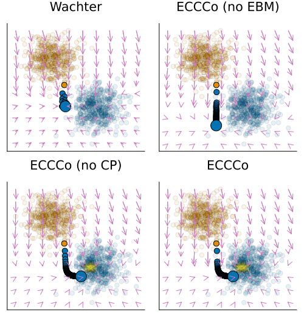

# ECCCo



*Energy-Constrained Counterfactual Explanations.*

This work is currently undergoing peer review. This README is therefore only meant to provide reviewers access to the code base. The code base will be made public after the review process.

## Inspecting the Package Code

This code base is structured as a Julia package. The package code is located in the `src/` folder.

## Inspecting the Code for Experiments

We used [Quarto](https://quarto.org/) notebooks for prototyping and running experiments. The notebooks are located in the `notebooks/` folder, separated by dataset:

- [Linearly Separable](notebooks/linearly_separable.qmd)
- [Moons](notebooks/moons.qmd)
- [Circles](notebooks/circles.qmd)
- [MNIST](notebooks/mnist.qmd)
- [GMSC](notebooks/gmsc.qmd)

## Inspecting the Results

All results have been carefully reported either in the paper itself or in the supplementary material. In addition, we have released our results as binary files. These will be made publicly available after the review process. 

## Reproducing the Results

To reproduce the results, you need to install the package, which will automatically install all dependencies. Since the package is not publicly registered and you are looking at an anonymous repository that [cannot be cloned](https://anonymous.4open.science/faq#download), unfortunately, it is not possible to easily install the package and reproduce the results at this stage of the review process. 

However, provided that the package is indeed installed, you can reproduce the results by either running the experiments in the `experiments/` folder or using the notebooks listed above for a more interactive process. 

**Note**: All experiments were run on `julia-1.8.5`. Since pre-trained models were serialised on that version they may not be compatible with newer versions of Julia. 

### Command Line

The `experiments/` folder contains separate Julia scripts for each dataset and a [run_experiments.jl](experiments/run_experiments.jl) that calls the individual scripts. You can either cun these scripts inside a Julia session or just use the command line to execute them as described in the following.

To run the experiment for a single dataset, (e.g. `linearly_separable`) simply run the following command:

```shell
julia experiments/run_experiments.jl -- data=linearly_separable
```

We use the following identifiers:

- `linearly_separable` (*Linearly Separable* data)
- `moons` (*Moons* data)
- `circles` (*Circles* data)
- `mnist` (*MNIST* data)
- `gmsc` (*GMSC* data)

To run all experiments at once you can instead run

```shell
julia experiments/run_experiments.jl -- run-all
```

Pre-trained versions of all of our black-box models have been archived as `Pkg` [artifacts](https://pkgdocs.julialang.org/v1/artifacts/) and are used by default. Should you wish to retrain the models as well, simply use the `retrain` flag as follows:

```shell
julia --project=experiments experiments/run_experiments.jl -- retrain dataname=linearly_separable
```

```shell
mpiexecjl --project=experiments -n 4 julia experiments/run_experiments.jl -- dataname=linearly_separable output_path=results parallel
```

When running the experiments from the command line, the parameter choices used in the main paper are applied by default. To have control over these choices, we recommend you instead rely on the notebooks.

### Notebooks

To run the notebooks and ensure that all package dependencies are installed, you need to clone this repo and open it on your device. The first cell in each notebook sets up the environment. You may have to [instantiate](https://pkgdocs.julialang.org/v1/api/#Pkg.instantiate) the local environment once. Should you prefer working with Jupyter notebooks instead of Quarto, you can easily [convert](https://quarto.org/docs/tools/vscode-notebook.html#converting-notebooks) them through a single command.

